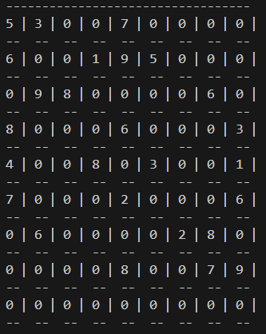
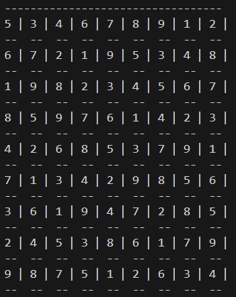

### Constraints:
1. Numbers range from 1 to 9.
2. Each number can only appear once in a row.
3. Each number can only appear once in a column.
4. Each 3x3 square of cells can only contain each number once.

### Approach:
There will be multiple solutions, which can be represented as a tree. We will traverse the tree using Depth-First Search (DFS), moving down the tree rather than exploring its side branches. When we encounter an error in a particular branch, we backtrack to the previous branch and continue exploring. This approach allows us to avoid exploring all branches.

* Best case scenario: The result is found in the first branch.
* Worst case scenario: We explore all branches to find the optimal solution.

***The Sudoku board:***

***The solution:***

